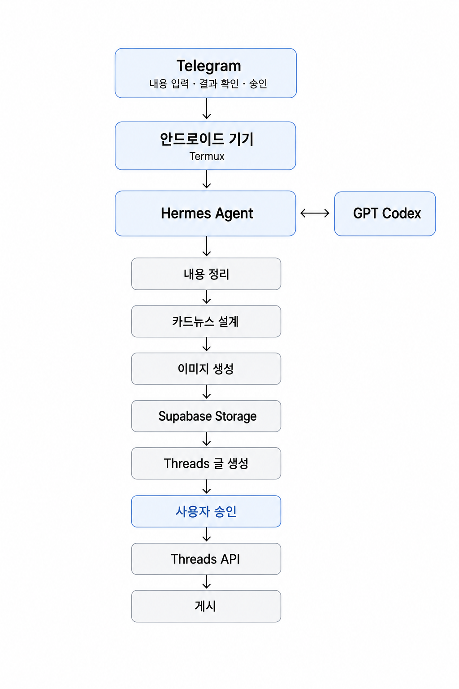
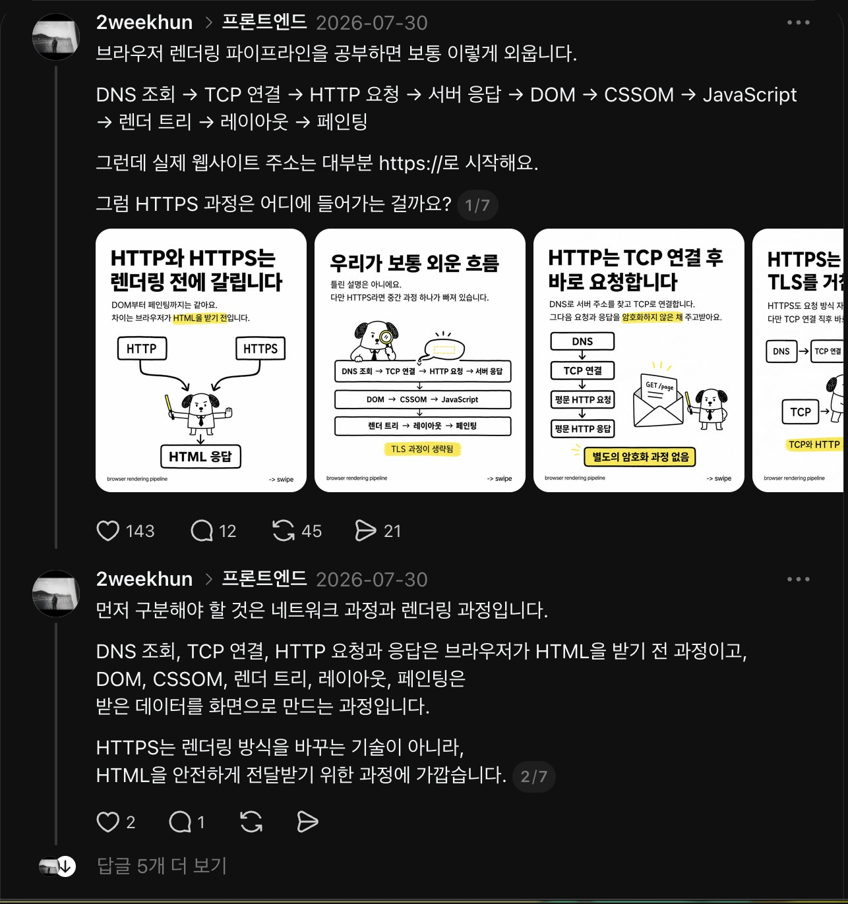
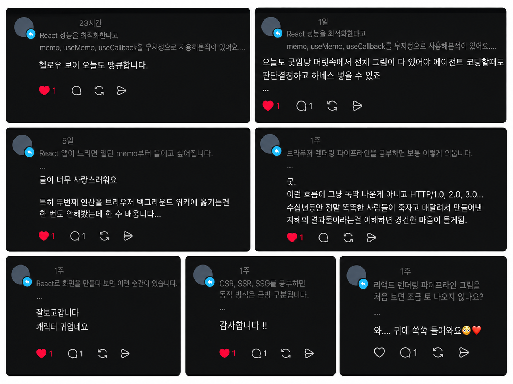

# 안드로이드 기기 기반 Hermes Agent

남는 안드로이드 기기에서 **Hermes Agent와 GPT Codex를 실행하고, Telegram을 인터페이스로 사용해 Threads 콘텐츠 제작과 게시 과정을 자동화하는 개인 AI Agent**입니다.

단순히 글을 생성하는 데서 끝나는 것이 아니라,

**내용 입력 → 카드뉴스 설계 → 이미지 생성 → 이미지 호스팅 → Threads 글 생성 → 사용자 승인 → 게시**

과정을 하나의 워크플로우로 연결하는 것을 목표로 구현하고 있습니다.

## 만든 이유

Threads에서 개발 학습 내용을 카드뉴스와 기술 글 형태로 직접 제작해 운영했고, **별도의 지인 유입 없이 약 한 달 만에 팔로워 300명**을 만들었습니다.

콘텐츠 형식에 대한 반응은 확인할 수 있었지만, 하나의 게시물을 만들기 위해 반복적으로 다음 작업을 해야 했습니다.

* 학습한 내용 정리
* 카드뉴스 구성 설계
* 카드뉴스 이미지 제작
* Threads용 본문 별도 작성
* 이미지 업로드
* 게시물 등록

각 작업 자체는 어렵지 않았지만, 콘텐츠를 만들 때마다 같은 흐름을 반복해야 한다는 문제가 있었습니다.

그래서 사용하지 않는 안드로이드 기기를 상시 실행 환경으로 활용하고, AI Agent가 반복 작업을 처리하도록 구성했습니다.

## 해결 방향

콘텐츠를 완전 자동으로 게시하는 방식보다는 **AI가 제작을 담당하고 최종 결정은 사용자가 하는 Human-in-the-loop 구조**를 선택했습니다.

Telegram으로 원본 내용을 전달하면 Hermes Agent가 정해둔 프롬프트와 작업 순서에 따라 콘텐츠를 제작합니다.

최종 결과를 Telegram에서 확인한 뒤 사용자가 승인한 경우에만 Threads API를 호출하도록 구성하는 것이 핵심입니다.

## 전체 워크플로우

### Telegram으로 내용 입력

개발하면서 학습한 내용이나 게시하고 싶은 주제를 Telegram으로 전달합니다.

별도의 관리자 페이지를 만들지 않고 Telegram을 Agent의 입출력 인터페이스로 사용해, PC 없이도 콘텐츠 생성 요청과 결과 확인이 가능하도록 했습니다.

### Hermes Agent가 작업 흐름 관리

안드로이드 기기의 Termux 환경에서 Hermes Agent를 실행합니다.

Hermes는 입력된 내용을 바탕으로 각 작업을 순서대로 실행하고, 필요한 작업에서는 GPT Codex를 활용합니다.

Agent가 한 번에 결과를 생성하는 방식보다 작업을 단계별로 분리해 각 단계의 역할을 명확하게 구성했습니다.

### 카드뉴스 설계

입력된 원본 내용을 카드뉴스 제작용 프롬프트에 전달합니다.

단순히 내용을 요약하는 것이 아니라,

* 어떤 내용을 몇 장으로 나눌지
* 각 카드의 핵심 메시지는 무엇인지
* 어떤 순서로 설명할지
* 시각적으로 어떤 요소를 표현할지

를 먼저 구조화합니다.

즉, 이미지 생성 전에 **콘텐츠 구조를 먼저 설계하는 단계**를 둡니다.

### 이미지 생성

설계된 카드뉴스 구조를 기반으로 이미지를 생성합니다.

콘텐츠 구조와 이미지 생성을 분리함으로써, 이미지 모델이 임의로 내용을 구성하는 것이 아니라 앞 단계에서 정의한 내용을 시각적으로 표현하도록 구성합니다.

### Supabase Storage에 이미지 저장

생성된 이미지는 Threads API에서 접근할 수 있도록 **Supabase Storage**에 업로드합니다.

로컬 안드로이드 기기에만 이미지를 저장하지 않고 외부에서 접근 가능한 URL을 생성해 이후 Threads 게시 과정에서 사용할 수 있도록 합니다.

### Threads 글 생성

카드뉴스와 별도로 Threads 본문 생성용 프롬프트를 실행합니다.

이미지에 들어가는 짧은 문장과 Threads에서 읽히는 본문의 역할이 다르기 때문에 하나의 프롬프트에서 동시에 생성하지 않고 각각 분리했습니다.

Threads 글은 다음과 같은 방향으로 생성합니다.

* 실제 개발 과정에서 발생할 수 있는 문제에서 시작
* 개념 정의보다 필요한 이유를 먼저 설명
* 문법보다 역할과 실무 판단 기준을 중심으로 설명
* 카드뉴스에서 생략한 내용을 본문에서 보완

### 사용자 승인

AI가 생성한 결과를 바로 게시하지 않습니다.

Telegram으로 최종 카드뉴스와 Threads 글을 전달하고, 사용자가 결과를 확인한 뒤 승인한 경우에만 게시 단계로 넘어갑니다.

이를 통해 자동화의 편의성을 유지하면서도 잘못된 내용이나 원하지 않는 콘텐츠가 자동으로 공개되는 것을 방지합니다.

### Threads API 게시

승인된 콘텐츠는 Threads API를 통해 게시합니다.

Threads OAuth 인증과 Access Token 발급 과정을 구성했으며, API를 통한 텍스트 게시까지 검증했습니다.

최종적으로 이미지 게시까지 연결해 Telegram에서 승인하는 것만으로 전체 게시 과정이 완료되는 흐름을 구현하고 있습니다.

## 구현하면서 중요하게 본 부분

### Agent가 모든 것을 결정하지 않도록 구성

콘텐츠 생성과 게시를 모두 자동화할 수 있지만, 외부에 공개되는 결과물까지 Agent가 임의로 결정하는 것은 적합하지 않다고 판단했습니다.

따라서 콘텐츠 제작은 자동화하되 게시 직전에 사용자 승인 단계를 두었습니다.

### 하나의 거대한 프롬프트보다 작업 단위 분리

카드뉴스 설계, 이미지 생성, Threads 본문 작성을 하나의 프롬프트에서 처리하지 않았습니다.

각 작업의 입력과 목적이 다르기 때문에 작업별 프롬프트를 분리하고 Hermes Agent가 순서를 관리하도록 구성했습니다.

이를 통해 특정 단계의 결과가 좋지 않을 경우 전체 과정을 다시 실행하지 않고 해당 단계만 수정할 수 있도록 했습니다.

### 별도 서버 대신 남는 안드로이드 기기 활용

개인 자동화를 위해 별도의 클라우드 서버를 추가하기보다 사용하지 않는 안드로이드 기기를 실행 환경으로 활용했습니다.

Termux 위에서 Agent를 실행하고 Telegram을 인터페이스로 사용해, 별도의 웹 UI 없이도 상시 사용할 수 있는 개인 Agent 환경을 구성했습니다.

## 기술 구성

| 영역                | 사용 기술            |
| ----------------- | ---------------- |
| Agent 실행 환경       | Android, Termux  |
| Agent             | Hermes Agent     |
| AI / Coding Agent | GPT Codex        |
| 사용자 인터페이스         | Telegram         |
| 이미지 저장            | Supabase Storage |
| 콘텐츠 게시            | Threads API      |
| 인증                | OAuth 2.0        |

## 직접 운영 결과

실제로 제작해 게시한 카드뉴스입니다.

게시 후 받은 실제 반응입니다.

카드뉴스를 직접 운영하며 콘텐츠 형식의 가능성을 확인했고, 반복되는 제작 과정을 자동화할 가치가 있다고 판단했습니다.